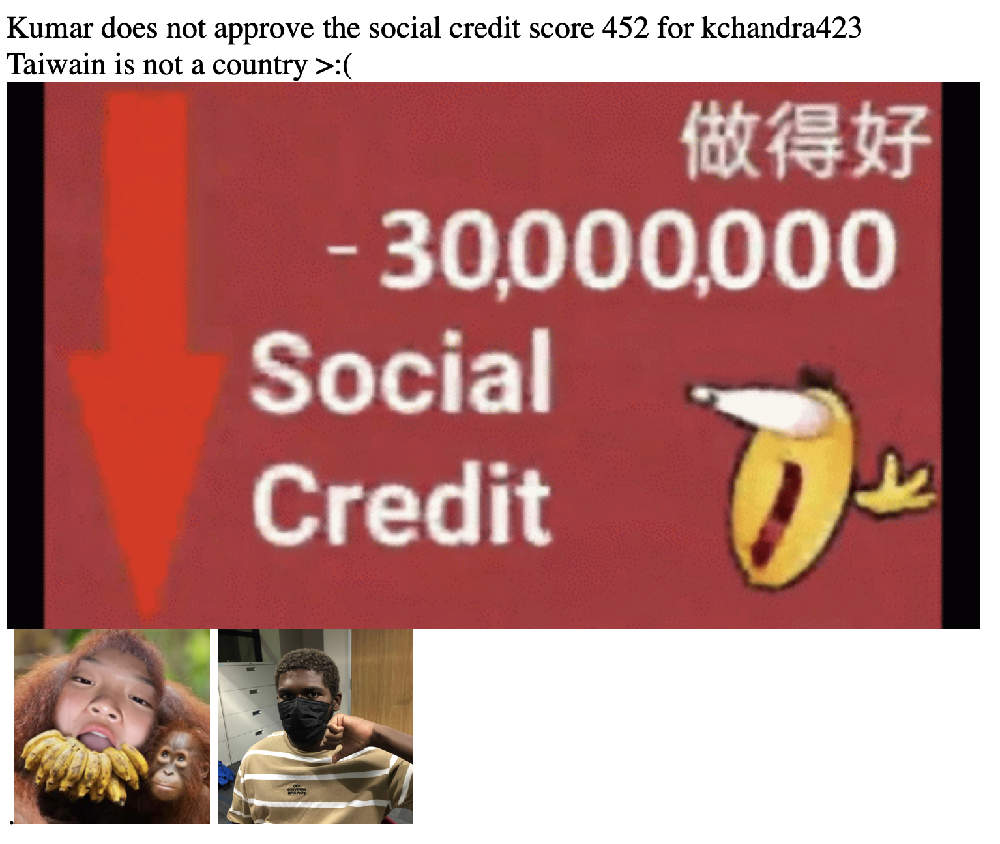

# SocialCreditEvaluator

Kumar approves.

Our submission to CodeDay SF BayArea in Pleasonton (First in show)

***

### Overview

This program is a website that takes in someone's github username and gives their "social credit score". While the
references to the ccp are mostly just jokes, this does do a decent job of seeing how good someone's github is. It is
also different from other services which greatly inflate how good peoples githubs are.

You can access [the site at](https://socialcreditevaluator-production.up.railway.app)
although be aware that for people with lots of repositories, responses can be very slow. If we had more time, we would
have liked to make the website a lot nicer.

***

### Responses

Scores range from 0 - 1000 with a higher number indicating a better score

"Good" profiles

"Bad" profiles

